# tanaoroshi - セッションログ棚卸しプラグイン

Claude Codeとのセッションログから価値ある発見（Findings）を抽出し、プロジェクト知識として蓄積するプラグイン。

## 特徴

- **自動保存**: セッション終了時にログを自動保存
- **棚卸し**: 「棚卸しして」と言うだけで発見を抽出・整理
- **カテゴリ管理**: ユーザー定義カテゴリ + 自動振り分け
- **Claude Codeとの連携**: 蓄積した知識を自動参照するルールを生成

## プラグインの影響範囲

このプラグインがプロジェクトに与える影響の一覧です。

### 読み取り
| 対象 | タイミング | 説明 |
|------|-----------|------|
| セッションログ（`.jsonl`） | 棚卸し実行時 | Claude Codeが自動生成するトランスクリプト |
| `.claude/tanaoroshi.json` | 棚卸し実行時 | カテゴリ設定の読み込み |

### 作成・更新
| 対象 | タイミング | 説明 |
|------|-----------|------|
| `.claude/.tanaoroshi/logs/pending/*.jsonl` | セッション終了時 | セッションログのコピーを保存 |
| `.claude/.tanaoroshi/.gitignore` | 初回セッション終了時 | ログをGit管理外にする |
| `.claude/findings/**/*.md` | 棚卸し実行時 | 抽出した発見を保存 |
| `.claude/findings/index.md` | 棚卸し実行時 | 発見の一覧を更新 |
| `.claude/rules/findings.md` | 棚卸し実行時 | 自動参照ルールを生成 |

### 移動・削除
| 対象 | タイミング | 説明 |
|------|-----------|------|
| 処理済みログ → `logs/{year}/{month}/` | 棚卸し実行時 | 有用なログをアーカイブ |
| 不要なログ → 削除 | 棚卸し実行時 | 発見がないログを削除 |

## 処理フロー

```mermaid
flowchart TD
    subgraph "セッション終了時（自動）"
        A[セッション終了] --> B[SessionEnd Hook 発火]
        B --> C[save-session-log.sh 実行]
        C --> D[ログを pending/ にコピー]
    end

    subgraph "棚卸し実行時（手動）"
        E["「棚卸しして」"] --> F[tanaoroshi Skill 起動]
        F --> G[tanaoroshi.json 読み込み]
        G --> H[pending/*.jsonl を取得]
        H --> I{ログあり?}
        I -->|No| J[終了]
        I -->|Yes| K[jq でメッセージ抽出]
        K --> L{棚卸しセッション<br>自体?}
        L -->|Yes| M[ログを削除]
        L -->|No| N[発見を抽出]
        N --> O{価値ある<br>発見あり?}
        O -->|No| M
        O -->|Yes| P[カテゴリを判定]
        P --> Q[findings/*.md に保存]
        Q --> R[index.md 更新]
        R --> S[rules/findings.md 生成]
        S --> T["ログを {year}/{month}/ に移動"]
        T --> U[結果を報告]
    end
```



## インストール
```bash
/plugin marketplace add chatii/claude-code-tanaoroshi
/plugin install tanaoroshi
```

## 使い方

```
棚卸しして
```

または `セッションログを整理して` / `発見をまとめて` でも実行可能。

### ディレクトリ構成
```
.claude/
├── tanaoroshi.json              # 設定ファイル
├── findings/                    # 発見の蓄積先
│   ├── index.md                 # 発見の一覧
│   ├── {category}/              # ユーザー定義カテゴリ
│   └── _etc/                    # 自動振り分けカテゴリ
│       └── {autoCategoryName}/
├── rules/
│   └── findings.md              # 自動生成される参照ルール
└── .tanaoroshi/
    └── logs/
        ├── pending/             # 未処理ログ
        └── {year}/{month}/      # 処理済みログ
```

## 設定

`.claude/tanaoroshi.json` を作成：
```json
{
  "outputDir": ".claude/findings",
  "categories": [
    { "name": "docker" },
    { "name": "testing" },
    {
      "name": "decisions",
      "description": "技術選択の理由、方針決定の経緯"
    }
  ]
}
```

| キー | デフォルト | 説明 |
|------|-----------|------|
| `outputDir` | `.claude/findings` | 発見の出力先 |
| `categories` | `[]` | カテゴリ定義の配列 |

### カテゴリの振り分け

1. 設定された `categories` に当てはまる → `{outputDir}/{name}/`
2. どれにも当てはまらない → `{outputDir}/_etc/{autoCategoryName}/`

`_etc/` に同じカテゴリが増えてきたら、`categories` に追加して正式なカテゴリに昇格できる。

## 記録される発見

### 記録すべきもの

- マニュアルに書いてない挙動
- 実際にやってみて初めてわかったこと
- 特定の組み合わせでの挙動
- ハマりポイントと解決策
- ベストプラクティス
- 技術選択の理由と経緯

### 記録しないもの

- 概念の一般的な説明
- 公式ドキュメントのコピー
- 単純な使い方

## 要件

- Claude Code v2.0.12 以上
- jq（セッションログの処理に使用）

## ライセンス

MIT
